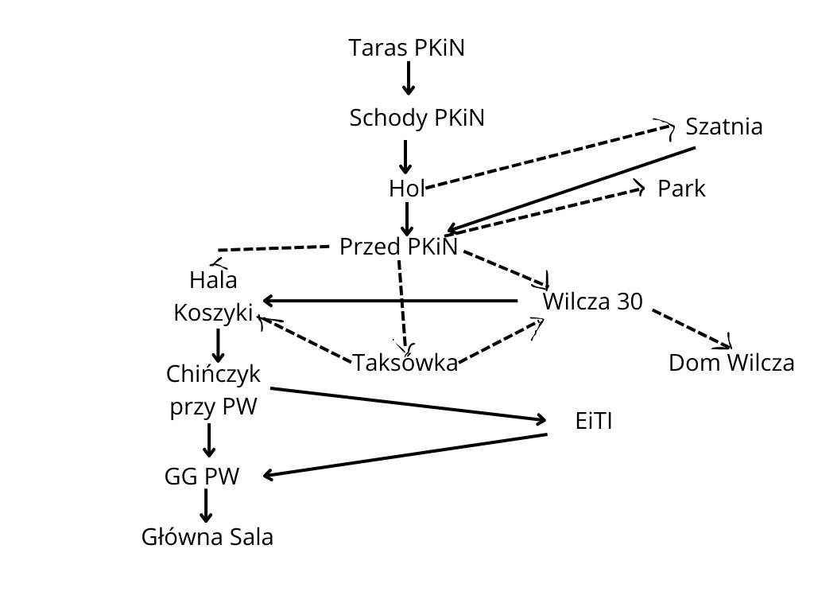

Kornelia Błaszczuk
Aleksandra Raczyńska
Aleksander Gołębiewski

-----------
Temat gry
---
**Budząc się na tarasie widokowym Pałacu Kultury i Nauki, nie pamiętasz niczego z poprzedniej nocy.** Warszawa rozciąga się przed tobą, skąpana w porannym świetle, a w głowie kołacze jedno pytanie: _Co się właściwie wydarzyło?_

Aby poznać prawdę, musisz przemierzyć miasto, odwiedzając zarówno jego najbardziej znane miejsca, jak i ukryte zakątki. Po drodze spotkasz intrygujące postaci – niektórzy zaoferują pomoc, inni zażądają czegoś w zamian. Czy podejmiesz właściwe decyzje? Czy odkryjesz wszystkie sekrety Warszawy?

Każdy wybór ma znaczenie. Czy uda ci się osiągnąć najlepsze możliwe zakończenie?

Spełnienie założeń zadania
---

Zgodnie z założeniami zadania w grze powinien wystąpić jeden (lub więcej) motywów:
- zamknięte drzwi, które trzeba jakoś otworzyć (drzwi do Głównej Sali w GG PW, które należy otworzyć kluczem),
- ukryty przedmiot, który trzeba znaleźć (klucz do otworzenia drzwi Głównej Sali GG PW),
- niekompletny przedmiot, który trzeba skompletować (na przestrzeni gry gracz zbiera części notatki),
- ograniczone zasoby, jak czas lub pieniądze, do wykonania zadania (pieniądze, bez których nie kupimy pewnych rzeczy, w tym części notatki).

Graf lokacji
---

Ograniczone zasoby - pieniądze
---

Ich dobre gospodarowanie jest ważne, aby móc otrzymać dobre zakończenie. Poniżej rozpiska wydatków i sposobów zdobycia pieniędzy.

| **Akcja**                                       | **Koszt/Zysk** |
| ----------------------------------------------- | -------------- |
| Przeszukanie kieszenie na tarasie PKiN          | +20 zł         |
| Podniesienie pieniędzy na schodach PKiN         | +[5, 15] zł         |
| Nakarmienie gołębi w parku                      | -5 zł          |
| Obejrzenie fontanny w parku                     | +[2, 10] zł          |
| Wzięcie taksówki do Hali Koszyki lub Wilczej 30 | -20 zł         |
| Wykupienie notatki od profesora filozofii       | -10 zł         |
| Zakupy w Chińczyku przy PW                      | -10 zł         |

